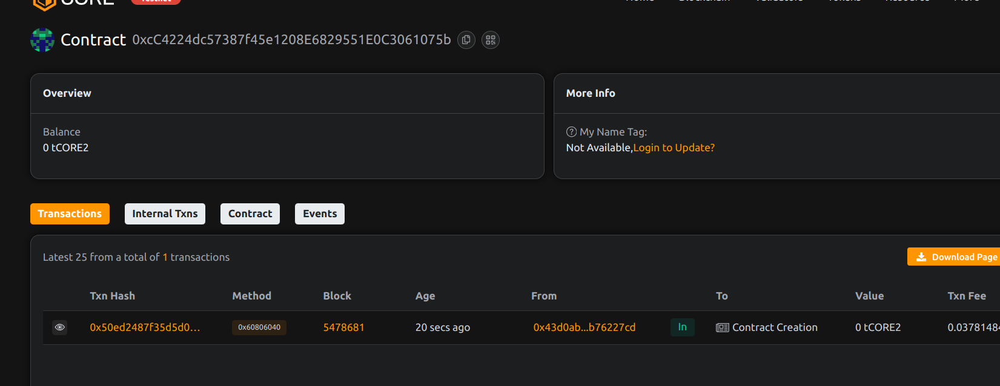

# ClaimChain – Insurance Claim Verification and Tracking on Blockchain

## 📄 Project Description

ClaimChain is a decentralized insurance claims system that brings transparency and trust to the claims lifecycle—from submission to settlement—by leveraging blockchain immutability.

## 🎯 Project Vision

To eliminate fraud, delays, and opacity in insurance claims through a transparent, auditable, and efficient smart contract system.

## ✨ Key Features

- 📝 Submit and store insurance claims on-chain
- 🔍 Claim verification and rejection logic
- 💸 Direct settlements through the blockchain
- 👤 Role-based permissions (claimant/insurer)

## 🔮 Future Scope

- NFT-based claim certificates
- Integration with oracles for off-chain incident validation
- DAO-based insurance underwriting
- Cross-border claim processing

## 📜 Contract Details
0xcC4224dc57387f45e1208E6829551E0C3061075b
